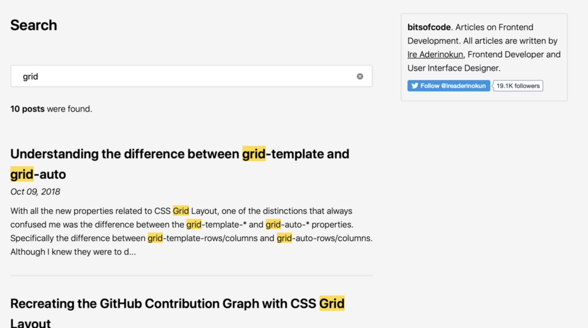

# SearchBarAssessment

This is a quick implementation of a Search Page in Vue.js as part of a technical interview

## The Task

Your task is to create a search box where users can type in keywords or phrases, and your application returns results with the text being searched for highlighted. You can use any front-end framework you want (e.g. React, Angular, Vue.js, etc.).

No need for a backend to be integrated. Store an array of articles in a constant and make use of it.

It should look something like the image below.



## Personal Additions To The Task

As this is a FrontEnd Job Interview, I decided to add the following

* Responsive Design: with CSS relative units such as %, em, rem
* Basic Animations
* Priority Search for Titles over Post Body Text

## Run The Project

Prerequisites:

* Node.js LTS

Open a Terminal Session in the root directory and run the following commands

```sh
npm install
```

```sh
npm run dev
```
